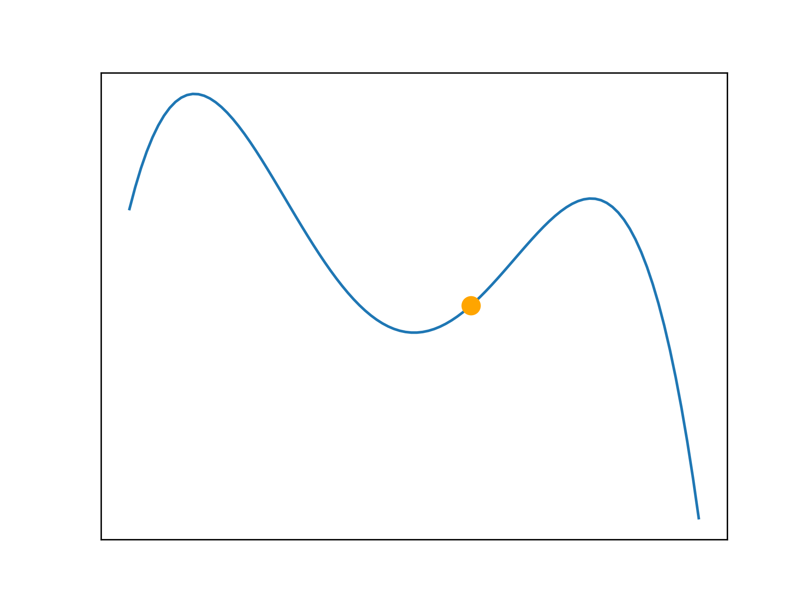
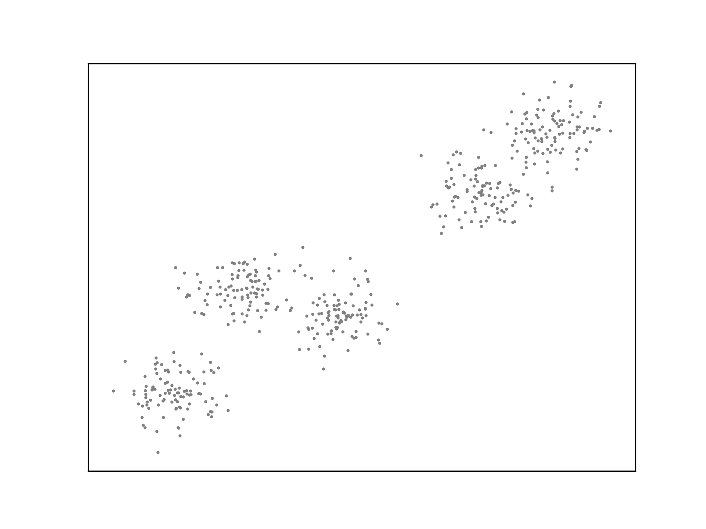

# ML/AI Code Notebooks

A small collection of simple machine learning algorithms implemented in
code, with visualisations.

## Notebooks

* [Linear Multivariable Regression](./notebooks/regression.ipynb)
* [Linear Classification](./notebooks/classification.ipynb)
* [Optimisation Problems](./notebooks/optimisation.ipynb)
* [Clustering](./notebooks/unsupervised.ipynb)

## Examples

